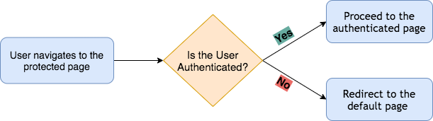

# How To Add Authentication to Angular Web App using Routing Guards


## Introduction 
In web applications, authentication plays a very important role. Whenever there is a prompt to login or check if this user should be authenticated to enter the website or not, it is handled using username and password authentication. While building a web application in angular js, one can build  a user authentication system using Angular Route Guards. In this blog, we will talk about what are route guards, how easy it is to configure them in your angular js based web applications and then you can build your own authentication using these! 


## Angular Authentication With Angular Route Guards

In your Angular application, you probably have pages you only want authenticated users to access, but how can you control this? Router in Angular is a service that provides navigation among views and URL manipulation capabilities. Route guards are then implemented to prevent users from navigating.




With Router Guards we can prevent users from accessing areas that they’re not allowed to access, or, we can ask them for confirmation when leaving a certain area. And these are particularly my favourite for authentication since route guards make this integration quick and easy! 

### Lets dive deeper :swimmer:
Now as we have got some idea on routing and use case of Route Guard lets jump into the way it’s created and implemented in Angular Js. 

Let us first build your code as follows: 
  - Create an Auth Directory so that it’s easy to understand the folder you are working in for your requirements.  
  - The route guard will work in conjunction with an auth service that contains an HTTP request to your server (or a serverless SDK request) that determines the user’s authenticated state.

Next, We can generate guards with [Angular Cli](https://angular.io/cli) from command line inside the directory you want to create the app.

First make sure you are in the right directory:
`
cd src/app/
`

At the end of this step, we will have the following directory structure: 

`
src -> app -> auth -> (auth.guard.ts & auth.service.ts)
`

#### Let us create our first file - `auth.guard.ts`
In order to create the guard file, angular has this amazing one-liner command:

`
ng generate guard auth
`

Here we call the `ng generate` to generate the `guard` authentication file. 

If the CLI (command line interface or your terminal) asks you which interface you would like to implement, choose `CanActivate`. You will see that the CLI will create the `/auth` directory for you if you haven’t created it yourself so far. 

The `auth.guard.ts` file should look like this:

````
import { Injectable } from '@angular/core';
import { CanActivate, ActivatedRouteSnapshot, RouterStateSnapshot, UrlTree } from '@angular/router';
import { Observable } from 'rxjs’;
@Injectable({
    providedIn: 'root'
})
export class AuthGuard implements CanActivate {
    canActivate(next: ActivatedRouteSnapshot, state: RouterStateSnapshot): Observable<boolean> {
    return true;
}}
````

Before we jump to he service file, you can read more about the different kinds of interfaces availble for implementation here: 

Note that in the above code, class `AuthGuard` implements `CanActivate` as we had previously selected `CanActivate` from the CLI. We will add more steps in this method later, but for now we can keep it as is. If you dont understand all of this now, it is completely fine, we will get to the further steps soon! 

> **CanActivate** is the interface that determines if the user can proceed to a specific route. I’ve edited the return type to be just `Observable < boolean >`. Your application might be different.


#### Let us create our service file - `auth.service.ts`

Now that we have created our guard file we also need a file which checks the authentication state of the user which is written in `auth.service.ts`. 

This function might call an API endpoint or a serverless SDK function. In this example we will assume you are calling an API endpoint. Here is an example of what your `auth.service.ts` file might look like:

````
import { HttpClient } from '@angular/common/http';
import { Injectable } from '@angular/core’;
@Injectable({
providedIn: 'root'
})
export class AuthService { constructor(private http: HttpClient) { } isAuthenticated() {
return this.http.get('/auth/isAuthenticated');
}}:
````

Let us understand the above code. Here we are create a class `AuthService` which uses the method `isAuthenticated()`. This function  is going to call an API endpoint `/auth/isAuthenticated` that will return an object indicating the authenticated status. 

`{ authenticated: (true | false) }`

Authentication status would be true or false (a boolean field) which can then be used for routing purposes.

#### Implementing Guards with Authservice

Now that we have our guard and service file ready, we need to import it and define it in the constructor. We also need to `import Router` to redirect the user to the login page if they are not authenticated. 

So let us make the following changes in our first file - `auth.guard.ts`:

````
...
import { AuthService } from './auth.guard';
import { ActivatedRouteSnapshot, CanActivate, Router, RouterStateSnapshot } from '@angular/router’;
...

	 constructor(private authService: AuthService, private router: Router) { } 
````


Now we will edit the `CanActivate` method in the guard file to use the `isAuthenticated()` function from service file.

````
import { Observable, of } from 'rxjs';
import { catchError, map } from 'rxjs/operators’;
... 
    canActivate(next: ActivatedRouteSnapshot, state: RouterStateSnapshot): Observable<boolean> 
    {
        return this.authService.isAuthenticated().pipe(map((response: { authenticated: boolean}) => {
            if (response.authenticated) {
                return true;
            }
        this.router.navigate(['/login']);
        return false;
        }), catchError((error) => {
        this.router.navigate(['/login']);
        return of(false);
        }));
    }}
````

In the above code, we are calling the `isAuthenticated()` function. We make use of the `pipe` and `map` operator to access the response. We then use the response to determine the user’s authenticated state. If the user is authenticated, we return true. Otherwise we use the Router to redirect the user to the login page and return false.

We are also using the `catchError` operator to catch any errors from the api. If there is an error, we will redirect the user to the homepage and return false. Did you notice that false is wrapped in an of `rxjs` operator? This is because catchError requires you to return an observable. Of takes a value and wraps that value in an observable.

#### Adding Guards to your Routes:
In the routing modules, `app-routing.module.ts`, you need to add the guard to all the routes you want to protect. 

#### `canActivate` guard

In this example, lets protect the user’s profile page. Add the `canActivate property` to the `profile` route that takes an array of guards with only your `AuthGuard`. Also add the `AuthGuard` to the providers array.

````
...
import { AuthGuard } './auth/auth.guard’;
const routes: Routes = [
...
{
    path: 'profile',
    component: ProfileComponent,
    canActivate: [ AuthGuard ]
}
];
@NgModule({
    imports: [RouterModule.forRoot(routes)],
    exports: [RouterModule],
    providers: [ AuthGuard ]
})
export class AppRoutingModule { }

````

Adding the guard to the route’s canActivate property ensures that this guard will be run anytime someone tries to access the profile page, only allowing them to proceed if they are authenticated. Additionally, without adding it to the providers array, your guard will not be registered and the application won’t run. Don’t forget to add any guards you may have in your application to this array.

#### `CanActivateChild` guard

`CanActivateChild` is almost similar to `CanActivate ` interface, the only difference is `CanActivate` is used to control the accessibility of the current route but `CanActivateChild` is used to prevent access to child routes of a given route, so by using this you don’t need to add canActive on each child route, in other words, you just need to add canActiveChild to parent route and it will work for child routes as well.

````
{
    path: 'dashboard’,
    canActivate: [AuthGuard],
    canActivateChild: [AuthGuard],
    component: DashboardComponent,
    children: [
        { path: ':id', component: InfoComponent},
        { path: ':id/edit', component: EditInfoComponent}
    ]
}
````

#### `CanLoad` guard
The `CanLoad` guard prevents the loading of the Lazy Loaded Module. We generally use this guard when we do not want to unauthorized user to navigate to any of the routes of the module and also stop then even see the source code of the module.

The Angular provides `canActivate` Guard, which prevents unauthorized user from accessing the route. But it does not stop the module from being downloaded. The user can use the chrome developer console to see the source code. The `CanLoad` Guard prevents the module from being downloaded.

First, we need to create a Angular Service, which implements the `CanLoad` Interface
The service must implement the `canLoad` method. This method must return either true or false. The Angular evaluates the `canLoad` and loads the lazy loaded module only if it returns true.

````
@Injectable()
export class AuthGuardService implements CanLoad {
  constructor(private router: Router) {
  }
 
  canLoad(route: Route): boolean {
    
    //determine whether you want to load the module
    //return true or false
    return true; 
  }
} 
````

Finally, we need to add the guards to the lazy loaded routes as shown below. Note that you can create more than one `CanLoad` guard, each guard runs in the order added.

`
{path: "admin", loadChildren:'./admin/admin.module#AdminModule', canLoad:[AuthGuardService]},
`

#### `CanDeactivate` guard

This route guard is used to keep the user from navigating away from a specific route. This guard can be useful when you want to prevent a user from accidentally navigating away without saving or some other undone tasks.

This route guard is a little bit different in implementation from the above-mentioned routes as it involves defining a method in the component class itself, which gets called whenever the user tries to navigate away from the route.

For example: Have you ever filled a form and mistakenly closed that tab or went back without completing the process and lost all those data? Prevent your users from experiencing the same.

Angular provides `CanDeactivate` (https://angular.io/api/router/CanDeactivate) route guard, which prevent navigating from one route to another, unless the given condition becomes truthy.

#### `Resolve` Guard

Angular provides `Resolve` interface with resolve method declaration. To create a Angular `Resolve` guard, we need to create a class by implementing Resolve interface. 
Resolve guard is used in the scenario where before navigating to any route we want to ensure whether there is data available or not. If there is no data then it has no meaning to navigate there. It means we have to resolve data before navigating to that route. Here comes the role of Angular `Resolve` guard. To use `Resolve` guard we need to create a class by implementing `Resolve` interface and define resolve method. The resolve method can return `Observable` or Promise or a `synchronous` value. After creating resolver class we need to configure resolver class in providers metadata of `@NgModule decorator` in application module and then we need to configure our resolver class in route configuration using resolve property of Angular `Route` interface. We can also provide a function with the resolve signature to use it as `Resolve` guard.

## Summary

We talk a lot today! Isn't that great! Well, I tried to cover most of the routing guards in detail, so that when you build you next web application you can pick and choose. Once you get hold of Angular Route Guards, adding authentication to your web pages will be seamless. 
This blog is written :writing_hand: in collaboration with Perceptron Labs (perceptronlabs.ai). 

*Happy Learning!* :metal: